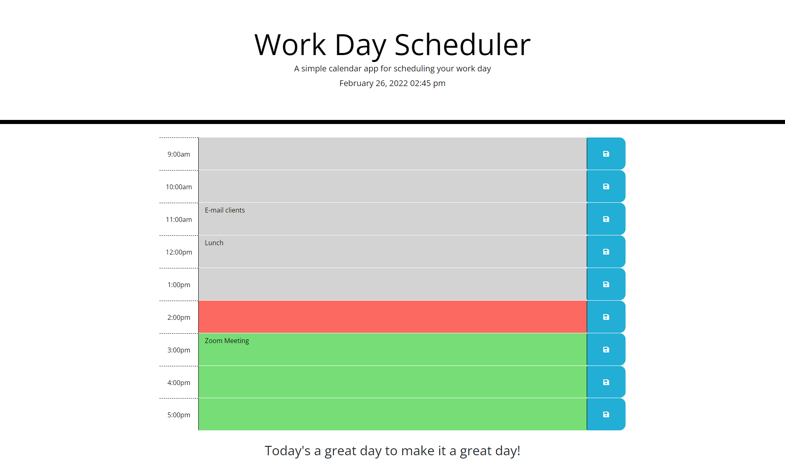

# Work Day Scheduler

## Description

This is a workday scheduler that can be used to schedule and save daily tasks based on the hour.  The scheduler updates based on the current time.  All past times are grayed out.  The current hour will be highlighted in red and all future hours will show as green.  All tasks added by the user are saved into local storage so they will remain through page refreshes and closures until the user deletes them. 

## Languages Used

- HTML
- CSS
- JavaScript

## Third-Party APIs Used

- jQuery
- Bootstrap
- moment.js

## Screenshot
   

## Deployment Link

https://uncgirl02.github.io/Proj5-EE-Day-Schedule/